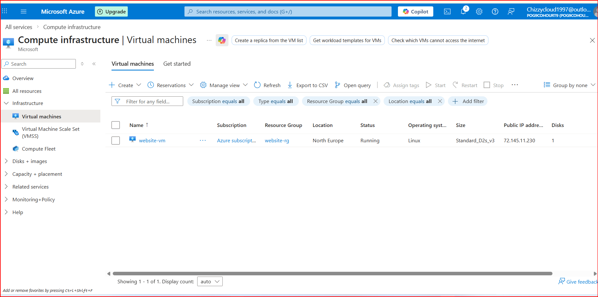
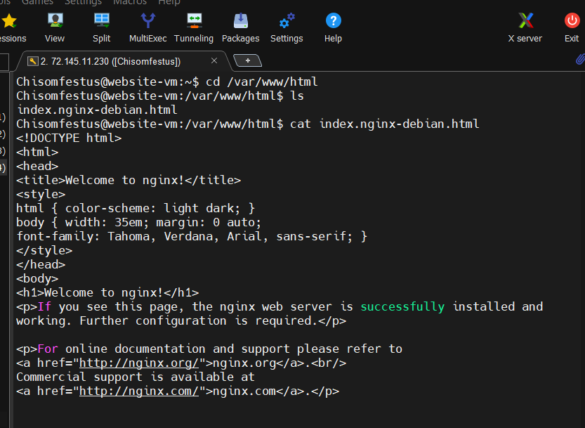
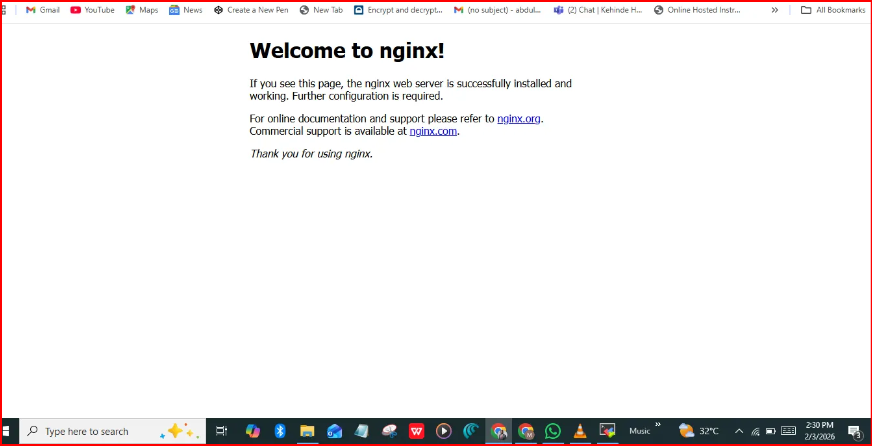
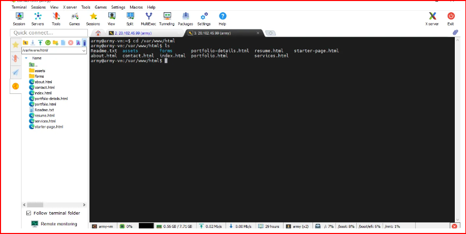

# HOW-TO-HOST-A-STATIC-WEBSITE
This guide walks you through hosting a static website on a Linux virtual machine using Nginx as the web server. You'll learn how to provision a virtual machine, configure networking, harden your server, install and configure the web server, deploy your website, set up DNS, and validate your deployment.
## 1. Virtual Machine and Network Setup

Start by provisioning a **Linux Virtual Machine** on your cloud platform of choice (Microsoft Azure, AWS, or GCP). Ubuntu 20.04 or 22.04 LTS is recommended.

### Required Infrastructure Components

You'll need the following resources:

- **Virtual Machine (VM)** — Hosts the web server and website files
- **Virtual Network (VNet / VPC)** — Provides isolated networking for the VM
- **Subnet** — A logical segment within the virtual network
- **Network Security Group (NSG / Security Group)** — Controls inbound and outbound traffic
- **Public IP Address** — Allows internet access to your website

---

### Inbound Security Rules (NSG)

Configure inbound rules to allow only necessary traffic:

- **HTTP (Port 80)** — Allow traffic from the internet to serve your website
- **HTTPS (Port 443)** — Optional but recommended for secure communication
- **SSH (Port 22)** — Allow access only from trusted IP addresses for administration

Limiting access to these ports reduces your attack surface and strengthens server security.

---

## 2. Connect to the Server Using SSH

Log in to the virtual machine from your local terminal:

ssh chisomfestus@72.145.11.230

### Verify the Logged-in User

### Check Active Logged-in Users

## 3. Update and Patch the Server

Updating the server helps remove vulnerabilities and ensures system stability.— (sudo apt update and sudo apt upgrade)

### Update Package Repository

sudo apt update (sudo apt update)

### Upgrade Installed Packages

sudo apt upgrade -y

### Check Packages That Can Be Upgraded

apt list --upgradable

## 4. Install and Verify Nginx Web Server

### Install Nginx

sudo apt install nginx -y

### Check Nginx Service Status

sudo systemctl status nginx

The service should show **active (running)**.

### Enable Nginx to Start on Boot

sudo systemctl enable nginx

### Test Default Nginx Page

Open a browser and visit:

http://72.145.11.230

## 5. Locate the Web Content Directory

Nginx serves web files from the following directory:

cd /var/www/html

List existing files:

ls

## 6. Download and Prepare a Website Template

### Download a Free Responsive Template

Choose a free HTML template from a trusted source (e.g., HTML5 UP, FreeCSS, Tooplate).

Example:

### Install Unzip (If Not Installed)

sudo apt install unzip -y

### Extract the Template

unzip website-template.zip

### Edit the Website Locally (Optional)

You can edit the template using **Visual Studio Code** or any code editor on your local machine, then upload it to the server:

scp -r website-folder username@PUBLIC_IP_ADDRESS:/tmp

## 7. Upload and Deploy the Website Files

Copy the website content to the Nginx root directory:

sudo cp -r website-folder/* /var/www/html/

If using the Kelly template:

sudo cp -r Kelly-1.0.0/* /var/www/html/

## 8. Configure DNS to Map Domain to Server IP

To access the website using a domain name:

1. Log in to your DNS provider or domain registrar
2. Create an **A Record**:
    - **Host**: @ pog9cohourt9.online
    - **IP Address**: 72.145.11.230
    - **TTL**: Default

Allow time for DNS propagation (a few minutes to several hours).

## 9. Test the Website

### Browser Test

http://pog9cohourt9.online

## 10. Conclusion

This documentation demonstrates how to:

- Create and secure a Linux virtual machine
- Configure networking and security rules
- Update and harden the server
- Install and configure Nginx
- Deploy a static website
- Map a domain name to the server

This setup provides a strong foundation for hosting static websites and can be extended with HTTPS (SSL), reverse proxies, or backend services.
